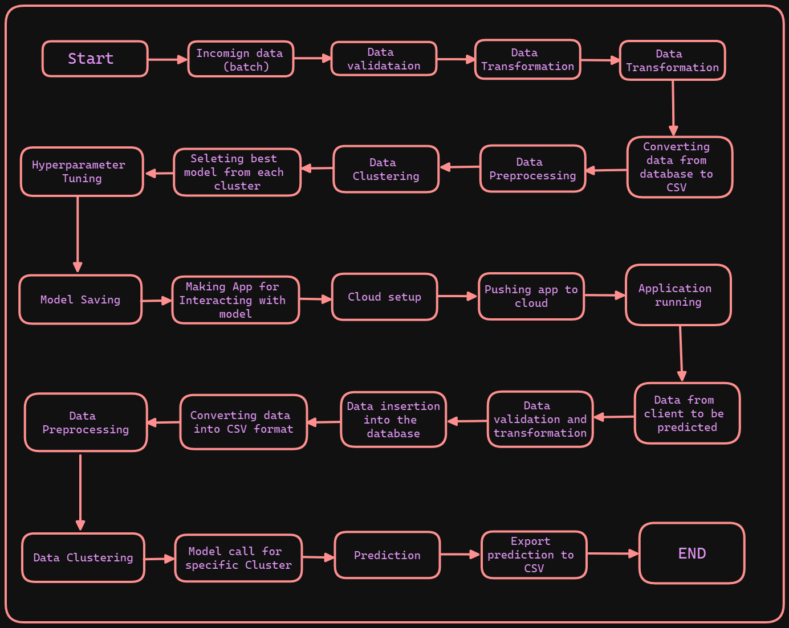

<div align="center">

# Wafers-Fault-Detection


</div>

## About

An end-to-end machine learning project for detecting faults in wafer sensor.

**Wafer** is a thin slice of semiconductor material, typically silicon, used in the production of integrated
circuits [more↗](https://en.wikipedia.org/wiki/Wafer_(electronics)#:~:text=In%20electronics%2C%20a%20wafer%20(also,in%20and%20upon%20the%20wafer.)). Sensors in wafer can get damaged which may lead to faulty wafers, depending on the cruciality of the sensor damaged the wafer may need rework process.

## Business Problem

Manufacturing of wafer involves many steps. At the end of the process, the wafer is tested for any faults. If the wafer
fails any test, The entire production has to be stopped and manual inspection is required to find the faulty wafer. The
Faulty wafer is then sent to the rework process. The rework process is very expensive and time consuming. So, it is very
important to detect the faults in the wafer before sending it to the rework process.

If there is some way to identify faulty wafers, quickly and effectively; it would increase the efficiency and profit of the business.  

## Modelling a data science problem

### 1. Problem Definition

The inputs of various sensors for different wafers have been provided. There are two classes of inputs, +1 and -1. The task is to build a machine learning model that can predict whether the wafer is faulty or not and thus identify the wafers that need to be sent to the rework process.

- ```+1``` means that the wafer is in a working condition.
- ```-1``` means that the wafer is faulty.

### 2. Data

The data is obtained as batches to a fixed location. The data contains the Wafer names and 590 columns of different sensor values for each wafer. The last column will have the "Good/Bad" value for each wafer.

- ```+1``` represents Good wafer.

- ```-1``` represents Bad Wafer.

Apart from this data, the client would also provide the schema which contain information like **Name of the files, Length of Date value in FileName, Length of Time value in FileName, Number of Columns, Name of the Columns, and their datatype.**

- The dataset is obtained from [zenodo](https://zenodo.org/record/4322353#.Y7K4y3ZBytU).

### 3. Solution

The solution is to build a machine learning model that can predict whether the wafer is faulty or not and thus identify the wafers that need to be sent to the rework process. The model will be deployed on a web application.

- **The overall solution is divided into 8 parts:**
  - Data ingestion
  - Data Preprocessing
  - Model Building
  - Model Evaluation
  - Model Deployment
  - Model Monitoring
  - Model Retraining
  - CI/CD

Architecture of the solution:

<div align="center">

</div>

**[Main ToDo](./ToDo.md)**

**[Contributions](./CONTRIBUTING.md)**

**[References](./Reference.md)**

**[License](./LICENSE)**
